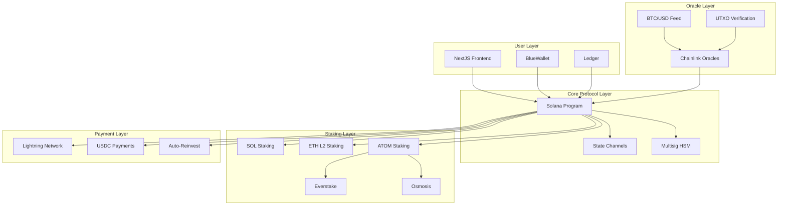

# Design Document

## Overview

The Vault Protocol is architected as a multi-chain system with Solana as the primary settlement layer, Cosmos for ATOM staking, and Ethereum L2 for ETH operations. The system uses a hub-and-spoke model where the Solana program acts as the central coordinator, managing BTC commitments, reward calculations, and cross-chain state synchronization. State channels handle high-frequency operations off-chain while periodic settlements ensure data integrity and finality.

## Architecture

### High-Level System Architecture



### Cross-Chain Communication

The protocol uses a hub-and-spoke model with Solana as the central hub:

1. **Solana Hub**: Main program handling BTC commitments, reward calculations, and state management
2. **Cosmos Spoke**: CosmWasm contracts for ATOM staking via Everstake and Osmosis
3. **Ethereum Spoke**: Smart contracts for ETH staking on L2 (Arbitrum/Optimism)
4. **State Synchronization**: Cross-chain message passing using Wormhole for state updates

## Components and Interfaces

### 1. BTC Commitment Module

**Core Contract**: `programs/vault/src/instructions/btc_commitment.rs`

```rust
pub struct BTCCommitment {
    pub user_address: Pubkey,
    pub btc_address: String,
    pub amount: u64,
    pub ecdsa_proof: Vec<u8>,
    pub timestamp: i64,
    pub verified: bool,
}

pub trait BTCCommitmentInterface {
    fn commit_btc(amount: u64, btc_address: String, ecdsa_proof: Vec<u8>) -> Result<()>;
    fn verify_balance(user: Pubkey) -> Result<bool>;
    fn update_commitment(user: Pubkey, new_amount: u64) -> Result<()>;
}
```

**Oracle Integration**:
- Chainlink BTC/USD price feeds for valuation
- Custom UTXO verification oracle for balance checks
- 60-second verification intervals with retry logic
- ECDSA proof validation to prevent spoofing

### 2. Staking Pool Module

**Core Contract**: `programs/vault/src/instructions/staking.rs`

```rust
pub struct StakingPool {
    pub total_staked: u64,
    pub sol_allocation: u32,  // 40%
    pub eth_allocation: u32,  // 30%
    pub atom_allocation: u32, // 30%
    pub rewards_accumulated: u64,
    pub last_update: i64,
}

pub trait StakingInterface {
    fn stake_protocol_assets(amounts: AssetAmounts) -> Result<()>;
    fn claim_staking_rewards() -> Result<u64>;
    fn rebalance_allocations() -> Result<()>;
    fn handle_slashing(validator: String, amount: u64) -> Result<()>;
}
```

**Staking Strategy**:
- SOL: Native Solana staking with validator selection
- ETH: Liquid staking on Arbitrum/Optimism via Lido/RocketPool
- ATOM: 20% Cosmos Hub via Everstake/Cephalopod, 10% Osmosis

### 3. Reward Distribution Module

**Core Contract**: `programs/vault/src/instructions/rewards.rs`

```rust
pub struct RewardDistribution {
    pub user_rewards: HashMap<Pubkey, u64>,
    pub total_protocol_rewards: u64,
    pub distribution_ratio: u8, // 50% to users
    pub payment_preferences: HashMap<Pubkey, PaymentType>,
}

pub enum PaymentType {
    BTC,
    USDC,
    AutoReinvest,
}

pub trait RewardInterface {
    fn calculate_user_rewards(user: Pubkey) -> Result<u64>;
    fn distribute_rewards(payment_type: PaymentType) -> Result<()>;
    fn set_auto_reinvest(user: Pubkey, enabled: bool) -> Result<()>;
}
```

### 4. Multisig Security Module

**Core Contract**: `programs/vault/src/instructions/multisig.rs`

```rust
pub struct MultisigWallet {
    pub signers: Vec<Pubkey>,
    pub threshold: u8, // 2-of-3
    pub hsm_keys: Vec<YubicoHSMKey>,
    pub pending_transactions: Vec<Transaction>,
}

pub trait MultisigInterface {
    fn propose_transaction(tx: Transaction) -> Result<u32>;
    fn sign_transaction(tx_id: u32, signature: Vec<u8>) -> Result<()>;
    fn execute_transaction(tx_id: u32) -> Result<()>;
    fn rotate_keys(new_keys: Vec<Pubkey>) -> Result<()>;
}
```

### 5. KYC and Compliance Module

**Core Contract**: `programs/vault/src/instructions/kyc.rs`

```rust
pub struct KYCStatus {
    pub user: Pubkey,
    pub tier: ComplianceTier,
    pub verification_date: i64,
    pub chainalysis_score: u8,
    pub commitment_limit: u64,
}

pub enum ComplianceTier {
    NonKYC,    // Up to 1 BTC
    KYCVerified, // Unlimited
}

pub trait KYCInterface {
    fn verify_user(user: Pubkey, documents: Vec<u8>) -> Result<()>;
    fn check_compliance(user: Pubkey, amount: u64) -> Result<bool>;
    fn update_limits(user: Pubkey, new_limit: u64) -> Result<()>;
}
```

### 6. Frontend Interface Layer

**NextJS Application**: `frontend/`

```typescript
interface VaultProtocolAPI {
  // BTC Operations
  commitBTC(amount: number, proof: string): Promise<TransactionResult>;
  verifyBalance(): Promise<BalanceInfo>;
  
  // Reward Operations
  claimRewards(paymentType: 'BTC' | 'USDC'): Promise<TransactionResult>;
  setAutoReinvest(enabled: boolean): Promise<void>;
  
  // Dashboard Data
  getUserStats(): Promise<UserStats>;
  getTreasuryStats(): Promise<TreasuryStats>;
  
  // Wallet Integration
  connectWallet(type: 'BlueWallet' | 'Ledger'): Promise<WalletConnection>;
}

interface UserStats {
  btcCommitted: number;
  rewardsEarned: number;
  rewardsPending: number;
  kycStatus: 'none' | 'pending' | 'verified';
}

interface TreasuryStats {
  totalAssets: number;
  totalRewardsUSD: number;
  // Note: Allocation details hidden to prevent whale manipulation
}
```

## Data Models

### 1. User Account Model

```rust
#[account]
pub struct UserAccount {
    pub owner: Pubkey,
    pub btc_commitment: BTCCommitment,
    pub reward_balance: u64,
    pub kyc_status: KYCStatus,
    pub payment_preference: PaymentType,
    pub auto_reinvest: bool,
    pub two_fa_enabled: bool,
    pub created_at: i64,
    pub last_activity: i64,
}
```

### 2. Treasury Model

```rust
#[account]
pub struct Treasury {
    pub total_assets: u64,
    pub sol_balance: u64,
    pub eth_balance: u64,
    pub atom_balance: u64,
    pub staking_rewards: u64,
    pub user_rewards_pool: u64,
    pub last_deposit: i64,
    pub deposit_schedule: DepositSchedule,
}

pub struct DepositSchedule {
    pub amount: u64, // $50 USD equivalent
    pub frequency: u32, // 14 days
    pub next_deposit: i64,
}
```

### 3. State Channel Model

```rust
pub struct StateChannel {
    pub channel_id: [u8; 32],
    pub participants: Vec<Pubkey>,
    pub state_hash: [u8; 32],
    pub nonce: u64,
    pub timeout: i64,
    pub signatures: Vec<Vec<u8>>,
}
```

## Error Handling

### 1. Oracle Failure Recovery

```rust
pub enum OracleError {
    FeedUnavailable,
    StaleData,
    InvalidProof,
    NetworkTimeout,
}

impl OracleErrorHandler {
    pub fn handle_failure(error: OracleError) -> Result<()> {
        match error {
            OracleError::FeedUnavailable => {
                // Retry with exponential backoff
                self.retry_with_backoff()?;
            },
            OracleError::StaleData => {
                // Use cached data if within tolerance
                self.use_cached_data()?;
            },
            OracleError::InvalidProof => {
                // Reject transaction and log security event
                return Err(VaultError::SecurityViolation);
            },
            OracleError::NetworkTimeout => {
                // Queue for retry within 60 seconds
                self.queue_retry(60)?;
            }
        }
        Ok(())
    }
}
```

### 2. Cross-Chain Communication Failures

```rust
pub enum CrossChainError {
    MessageTimeout,
    InvalidSignature,
    ChainUnavailable,
    StateDesync,
}

impl CrossChainErrorHandler {
    pub fn handle_cross_chain_error(error: CrossChainError) -> Result<()> {
        match error {
            CrossChainError::MessageTimeout => {
                // Resend message with higher gas
                self.resend_with_priority()?;
            },
            CrossChainError::StateDesync => {
                // Trigger state reconciliation
                self.reconcile_state()?;
            },
            _ => {
                // Fallback to manual intervention
                self.escalate_to_admin()?;
            }
        }
        Ok(())
    }
}
```

### 3. Payment System Failures

```rust
pub enum PaymentError {
    LightningFailure,
    InsufficientLiquidity,
    NetworkCongestion,
    InvalidAddress,
}

impl PaymentErrorHandler {
    pub fn handle_payment_failure(error: PaymentError, payment: Payment) -> Result<()> {
        match error {
            PaymentError::LightningFailure => {
                // Fallback to on-chain BTC
                self.fallback_to_onchain(payment)?;
            },
            PaymentError::InsufficientLiquidity => {
                // Queue payment for next cycle
                self.queue_payment(payment, Duration::hours(24))?;
            },
            _ => {
                // Retry with exponential backoff
                self.retry_payment(payment)?;
            }
        }
        Ok(())
    }
}
```

## Testing Strategy

### 1. Unit Testing

```python
# tests/test_btc_commitment.py
import pytest
from vault_client import VaultClient

class TestBTCCommitment:
    @pytest.fixture
    def vault_client(self):
        return VaultClient(network="devnet")
    
    @pytest.mark.asyncio
    async def test_commit_btc_success(self, vault_client):
        result = await vault_client.commit_btc(
            amount=0.1,
            btc_address="bc1q...",
            ecdsa_proof="proof_data"
        )
        assert result.success
        assert result.commitment_id is not None
    
    @pytest.mark.asyncio
    async def test_verify_balance_oracle_integration(self, vault_client):
        # Test oracle integration with mock data
        result = await vault_client.verify_balance("bc1q...")
        assert result.verified
        assert result.balance >= 0
```

### 2. Integration Testing

```python
# tests/test_integration.py
import pytest
from concurrent.futures import ThreadPoolExecutor
import asyncio

class TestIntegration:
    @pytest.mark.asyncio
    async def test_end_to_end_flow(self):
        # Test complete user journey
        tasks = [
            self.test_btc_commitment(),
            self.test_staking_rewards(),
            self.test_reward_distribution(),
            self.test_payment_processing()
        ]
        
        with ThreadPoolExecutor(max_workers=4) as executor:
            results = await asyncio.gather(*tasks)
            assert all(result.success for result in results)
```

### 3. Security Testing

```python
# tests/test_security.py
class TestSecurity:
    def test_multisig_requirements(self):
        # Test 2-of-3 multisig enforcement
        pass
    
    def test_ecdsa_proof_validation(self):
        # Test spoofing prevention
        pass
    
    def test_kyc_compliance_limits(self):
        # Test 1 BTC non-KYC limit
        pass
```

### 4. Performance Testing

```python
# tests/test_performance.py
class TestPerformance:
    def test_low_resource_constraints(self):
        # Test on 8GB RAM, 256GB storage
        memory_usage = self.measure_memory_usage()
        assert memory_usage < 4 * 1024 * 1024 * 1024  # 4GB limit
    
    def test_concurrent_users(self):
        # Test 1000 concurrent users
        pass
```

## Security Considerations

### 1. HSM Integration

- Yubico HSMs with CC EAL5+ certification
- Hardware-backed key generation and storage
- Secure key rotation procedures
- Tamper-evident logging

### 2. Smart Contract Security

- Certik audit requirements before mainnet deployment
- Slither static analysis via Kiro Hooks
- Formal verification for critical functions
- Bug bounty program post-launch

### 3. Oracle Security

- Multiple Chainlink oracle nodes for redundancy
- ECDSA proof validation for all BTC operations
- Time-based replay attack prevention
- Oracle manipulation detection algorithms

### 4. State Channel Security

- Cryptographic state commitments
- Dispute resolution mechanisms
- Timeout-based finality
- Fraud proof generation

This design provides a comprehensive architecture for The Vault Protocol, balancing security, scalability, and usability while maintaining the non-custodial nature and developer control requirements.