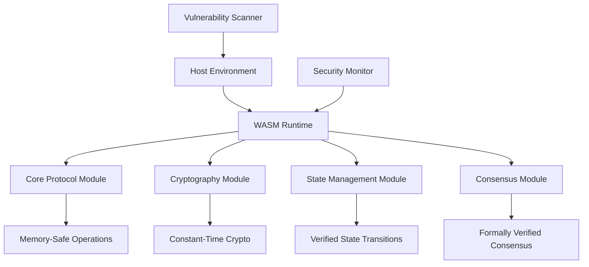
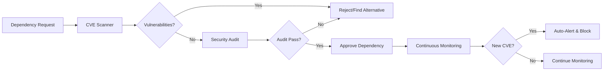

# Zero-CVE WebAssembly Migration Design

## Overview

This design document outlines the technical approach for migrating the VaultBTC protocol to a zero-CVE architecture using Rust and WebAssembly. The design addresses the current security vulnerabilities identified in the audit and establishes a foundation for long-term security maintenance.

## Current Security Issues Analysis

Based on the security audit, we have identified the following critical issues:

1. **RUSTSEC-2024-0344**: Timing variability in curve25519-dalek
2. **RUSTSEC-2024-0388**: Unmaintained derivative crate
3. **RUSTSEC-2024-0436**: Unmaintained paste crate
4. **RUSTSEC-2023-0033**: Borsh parsing vulnerability
5. **104 unwrap() calls**: Potential panic points
6. **Hardcoded secrets**: Test keys and API keys in source
7. **ECDSA validation failures**: Cryptographic implementation issues

## Architecture

### Core WebAssembly Runtime



### Security-First Dependency Management



## Components and Interfaces

### 1. WebAssembly Core Engine

**Purpose**: Sandboxed execution environment for all protocol logic

**Key Features**:
- WASI-based system interface with minimal permissions
- Memory isolation between modules
- Capability-based security model
- Performance monitoring and resource limits

**Interface**:
```rust
pub trait WasmEngine {
    fn load_module(&mut self, module: &[u8]) -> Result<ModuleId>;
    fn execute_function(&mut self, module_id: ModuleId, function: &str, args: &[Value]) -> Result<Vec<Value>>;
    fn get_memory(&self, module_id: ModuleId) -> Result<&[u8]>;
    fn set_resource_limits(&mut self, limits: ResourceLimits);
}
```

### 2. Zero-CVE Dependency Manager

**Purpose**: Automated vulnerability scanning and dependency management

**Key Features**:
- Real-time CVE database integration
- Automated dependency updates with security verification
- Alternative dependency suggestion system
- Build-time security verification

**Interface**:
```rust
pub trait DependencyManager {
    fn scan_dependencies(&self) -> Result<SecurityReport>;
    fn check_cve_status(&self, crate_name: &str, version: &str) -> Result<CveStatus>;
    fn suggest_alternatives(&self, vulnerable_crate: &str) -> Result<Vec<Alternative>>;
    fn auto_update_secure(&mut self) -> Result<UpdateReport>;
}
```

### 3. Hardened Cryptography Module

**Purpose**: Constant-time, side-channel resistant cryptographic operations

**Key Features**:
- Timing-attack resistant implementations
- Formal verification of critical algorithms
- Hardware security module integration
- Quantum-resistant algorithm preparation

**Interface**:
```rust
pub trait SecureCrypto {
    fn sign_ecdsa(&self, private_key: &SecretKey, message: &[u8]) -> Result<Signature>;
    fn verify_ecdsa(&self, public_key: &PublicKey, message: &[u8], signature: &Signature) -> Result<bool>;
    fn derive_key(&self, seed: &[u8], path: &DerivationPath) -> Result<SecretKey>;
    fn secure_random(&self, length: usize) -> Result<Vec<u8>>;
}
```

### 4. Formal Verification Framework

**Purpose**: Mathematical proof of protocol correctness and security

**Key Features**:
- TLA+ specifications for consensus protocols
- Coq proofs for cryptographic implementations
- Model checking for state transitions
- Automated theorem proving integration

**Interface**:
```rust
pub trait FormalVerification {
    fn verify_state_transition(&self, from: &State, to: &State, transition: &Transition) -> Result<Proof>;
    fn check_invariants(&self, state: &State) -> Result<Vec<InvariantViolation>>;
    fn prove_safety_property(&self, property: &SafetyProperty) -> Result<Proof>;
    fn verify_liveness_property(&self, property: &LivenessProperty) -> Result<Proof>;
}
```

## Data Models

### Security Configuration
```rust
#[derive(Debug, Clone, Serialize, Deserialize)]
pub struct SecurityConfig {
    pub max_cve_score: f32,
    pub allowed_vulnerability_types: Vec<VulnerabilityType>,
    pub auto_update_enabled: bool,
    pub formal_verification_required: bool,
    pub wasm_resource_limits: ResourceLimits,
}

#[derive(Debug, Clone, Serialize, Deserialize)]
pub struct ResourceLimits {
    pub max_memory_pages: u32,
    pub max_execution_time_ms: u64,
    pub max_fuel: u64,
    pub allowed_system_calls: Vec<SystemCall>,
}
```

### Vulnerability Tracking
```rust
#[derive(Debug, Clone, Serialize, Deserialize)]
pub struct VulnerabilityReport {
    pub cve_id: String,
    pub severity: Severity,
    pub affected_crates: Vec<CrateInfo>,
    pub mitigation_status: MitigationStatus,
    pub discovered_at: DateTime<Utc>,
    pub resolved_at: Option<DateTime<Utc>>,
}

#[derive(Debug, Clone, Serialize, Deserialize)]
pub enum MitigationStatus {
    Unresolved,
    InProgress { eta: DateTime<Utc> },
    Resolved { solution: MitigationSolution },
    Accepted { justification: String },
}
```

## Error Handling

### Panic-Free Error Management
```rust
// Replace all unwrap() calls with proper error handling
pub type Result<T> = std::result::Result<T, VaultError>;

#[derive(Debug, thiserror::Error)]
pub enum VaultError {
    #[error("Security violation: {0}")]
    SecurityViolation(String),
    
    #[error("CVE detected: {cve_id} in {crate_name}")]
    CveDetected { cve_id: String, crate_name: String },
    
    #[error("WebAssembly execution failed: {0}")]
    WasmExecutionFailed(String),
    
    #[error("Formal verification failed: {0}")]
    VerificationFailed(String),
    
    #[error("Cryptographic operation failed: {0}")]
    CryptographicError(String),
}
```

### Graceful Degradation
```rust
pub trait GracefulDegradation {
    fn handle_security_failure(&self, error: &VaultError) -> RecoveryAction;
    fn enter_safe_mode(&mut self) -> Result<()>;
    fn attempt_recovery(&mut self, action: RecoveryAction) -> Result<RecoveryStatus>;
}
```

## Testing Strategy

### 1. Security-First Testing
- **Vulnerability Injection Testing**: Deliberately introduce known vulnerability patterns to test detection
- **Fuzzing**: Use cargo-fuzz to test all input boundaries
- **Property-Based Testing**: Use proptest for mathematical property verification
- **Formal Model Testing**: TLA+ model checking for consensus protocols

### 2. WebAssembly Testing
- **Sandboxing Tests**: Verify WASM modules cannot escape their sandbox
- **Performance Tests**: Ensure WASM performance meets requirements
- **Resource Limit Tests**: Verify resource limits are enforced
- **Cross-Platform Tests**: Test WASM modules on different architectures

### 3. Cryptographic Testing
- **Known Answer Tests**: Verify against NIST test vectors
- **Side-Channel Testing**: Use timing analysis to detect vulnerabilities
- **Formal Verification**: Mathematical proofs of cryptographic correctness
- **Hardware Security Module Tests**: Integration testing with HSMs

## Implementation Phases

### Phase 1: Foundation (Weeks 1-4)
1. Set up zero-CVE dependency management system
2. Implement WebAssembly runtime with security sandboxing
3. Create formal verification framework foundation
4. Establish secure build pipeline

### Phase 2: Core Migration (Weeks 5-8)
1. Migrate cryptographic operations to hardened implementations
2. Convert core protocol logic to WebAssembly modules
3. Implement panic-free error handling throughout codebase
4. Add comprehensive security monitoring

### Phase 3: Verification & Hardening (Weeks 9-12)
1. Complete formal verification of critical protocols
2. Implement automated security testing pipeline
3. Add quantum-resistant cryptography preparation
4. Conduct comprehensive security audit

### Phase 4: Production Readiness (Weeks 13-16)
1. Performance optimization and benchmarking
2. Documentation and security runbooks
3. Incident response procedures
4. Final security certification

## Security Considerations

### Threat Model
- **Supply Chain Attacks**: Mitigated by dependency verification and reproducible builds
- **Side-Channel Attacks**: Mitigated by constant-time implementations
- **Memory Safety Issues**: Eliminated by Rust's ownership system
- **Logic Bugs**: Mitigated by formal verification
- **Runtime Attacks**: Mitigated by WebAssembly sandboxing

### Compliance Requirements
- **SOC 2 Type II**: Continuous security monitoring and controls
- **ISO 27001**: Information security management system
- **Common Criteria**: Formal security evaluation
- **FIPS 140-2**: Cryptographic module validation

## Monitoring and Alerting

### Real-Time Security Monitoring
```rust
pub struct SecurityMonitor {
    cve_scanner: CveScanner,
    runtime_monitor: RuntimeMonitor,
    crypto_monitor: CryptoMonitor,
    alert_system: AlertSystem,
}

impl SecurityMonitor {
    pub fn start_monitoring(&mut self) -> Result<()> {
        // Continuous CVE scanning
        self.cve_scanner.start_background_scan()?;
        
        // Runtime security monitoring
        self.runtime_monitor.monitor_wasm_execution()?;
        
        // Cryptographic operation monitoring
        self.crypto_monitor.monitor_crypto_operations()?;
        
        // Alert system activation
        self.alert_system.activate()?;
        
        Ok(())
    }
}
```

This design provides a comprehensive approach to achieving zero-CVE status while maintaining high performance and usability through WebAssembly and Rust's security guarantees.